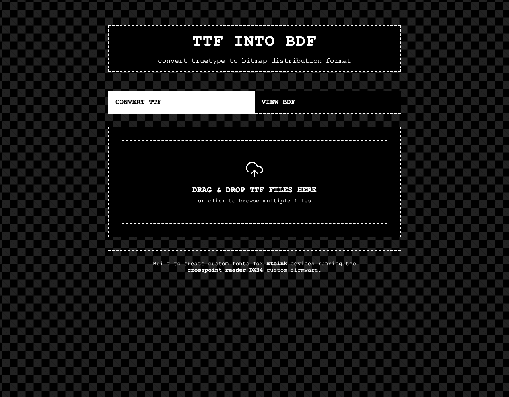

# ttf into bdf



A totally free, entirely client-side web application that converts TrueType Font (`.ttf`) files into Bitmap Distribution Format (`.bdf`) files directly in your browser. 

Hosted live at: [https://diogo7dias.github.io/bdf-fontcreator/](https://diogo7dias.github.io/bdf-fontcreator/)

## Features

- **TTF to BDF Conversion**: Accurately rasterizes vector fonts into bitmap formats.
- **Batch Processing**: Upload multiple `.ttf` files and specify multiple comma-separated output sizes at once.
- **Automatic ZIP Bundling**: Batch outputs are automatically bundled into a single `.zip` file for easy downloading.
- **Built-in BDF Viewer**: Features a massive-file-friendly BDF Viewer. Drop in a `.bdf` file (even 10MB+ files with 60,000+ characters) to instantly view the hex-decoded visual pixel art for every glyph!
- **100% Client-Side**: No backend servers. Your font files never leave your computer.

## How it Works

1. **Parsing:** We use `opentype.js` to parse the vector math of the TrueType font.
2. **Rasterization:** The app draws each character onto a hidden HTML5 `<canvas>` element at your specified output pixel sizes.
3. **BDF Generation:** We read the raw pixel data from the canvas, construct the bitmap matrix for each character, and generate `.bdf` text perfectly formatted to the BDF 2.1 specification.

## Development

Built with Vite, React, and TypeScript.

```bash
# Install dependencies
npm install

# Start local dev server
npm run dev

# Build for production
npm run build
```

## Aesthetic

Features a 90s retro web hacker aesthetic with a pure black & white palette, dashed borders, and a moving CSS-only pixel checkerboard background.

## About xteink

Built to create custom fonts for **xteink** devices running the [crosspoint-reader-DX34](https://github.com/diogo7dias/crosspoint-reader-DX34) custom firmware.
